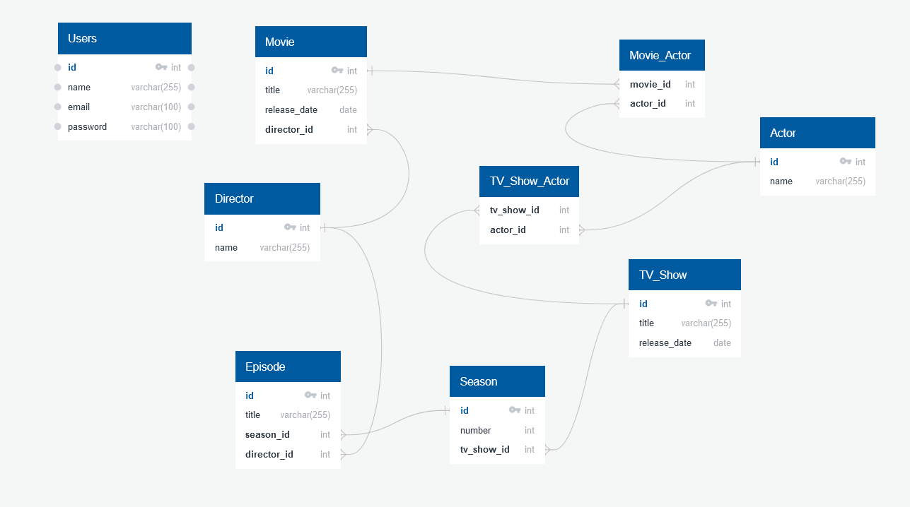

# Movie/TV Show Database API

This project is a RESTful API built using Node.js and TypeScript, designed to manage a database of movies, TV shows, actors, and related information. It follows the hexagonal architecture pattern for a clear separation of concerns and improved maintainability.

## Database Schema

The project utilizes the following relational database schema:

### Database Schema:



## Architecture

This project is structured using the **hexagonal architecture** (also known as ports and adapters architecture) pattern, which promotes:

- **Decoupling:** The core business logic of the application is independent of the infrastructure (database, UI, etc.).
- **Testability:** Business logic can be easily tested without dependencies on frameworks or specific data access methods.
- **Maintainability:** Changes in one area (e.g., the database) have minimal impact on other areas (e.g., business logic).
- **Adaptability:** Easy to change or extend the framework, external tools, or user interface by implementing new adapters.

### Layers:

1.  **Application (Core):**

    - Contains the core business logic of the application.
    - Defines use cases and orchestrates actions based on requests from the domain.
    - Completely independent of any specific implementation details.

2.  **Domain:**

    - Represents the domain objects of the application.
    - Contains entity and value classes.
    - Doesn't depend on any specific implementation and is independent.

3.  **Infrastructure:**
    - Contains specific implementation details of the external components of the system.
    - Includes adapters for data access (repositories), external services (mail, SMS, etc.), and frameworks (express).

### Implementation Details:

- **Use Cases:** Reside in the `use-cases` directory and implement specific business logic (e.g., retrieving movies, logging in users).
- **Repositories:** Located in the `repositories` directory, these provide a data access layer and are called by use cases.
- **Controllers:** Found in the `controllers` directory, they receive requests, call use cases, and return responses.
- **Middlewares:** Handles request and response interceptors
- **Config:** Loads configurations
- **Utils:** Generic tools

## Getting Started

Follow these steps to set up and run the project:

### Prerequisites:

- [Docker](https://www.docker.com/get-started) and [Docker Compose](https://docs.docker.com/compose/install/)
- [Node.js](https://nodejs.org/en/download/) (v18 or higher)
- [npm](https://www.npmjs.com/get-npm) (comes with Node.js)

### Steps:

1.  **Start the Database with Docker:**

    ```bash
    docker compose -f scripts/database.yml up -d
    ```

    This command starts the database server using docker compose.

2.  **Apply Database Migrations:**

    ```bash
    npm run migrations:up
    ```

    This command creates the database tables based on the schema.

3.  **Seed the Database:**

    ```bash
    npm run migrations:seed:up
    ```

    This command populates the database with initial data.

4.  **Start the Development Server:**
    ```bash
    npm run dev
    ```
    This will start the API server. You can access it at `http://localhost:3000` by default.

## API Endpoints

The project implements a REST API, with endpoints categorized by resource, including detailed descriptions of required request bodies (if any), parameters, and response structures:

### Authentication Endpoints

- `POST /auth/login`:

  - **Description:** Handles user login, authenticating with provided credentials, and issuing access and refresh tokens.

- `GET /auth/refresh-token`:
  - **Description:** Handles refreshing the access token using a valid refresh token.

### Movie Endpoints

- `GET /movies`:
  - **Description:** Retrieves a list of all movies. Requires a valid access token.

### Episode Endpoints

- `GET /episodes/:id`:
  - **Description:** Retrieves a specific episode by its ID. Requires a valid access token.

### User Endpoints

- `POST /users`:
  - **Description:** Creates a new user. Requires valid access token.

**Note:** All routes that require authentication, expect to receive a valid access token in the `Authorization` header, using the `Bearer` scheme (e.g., `Authorization: Bearer <your_token>`).
